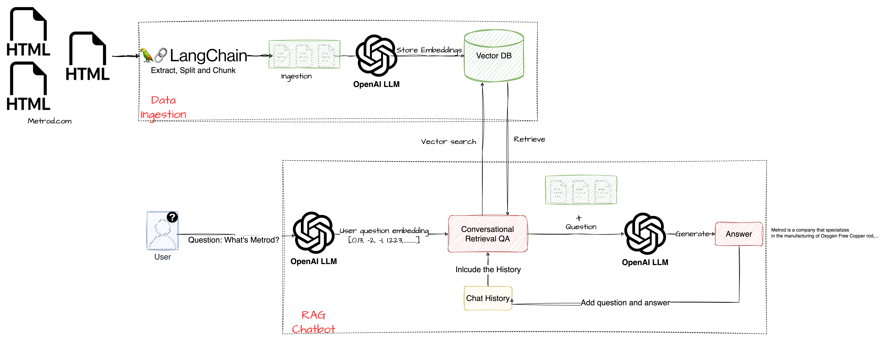
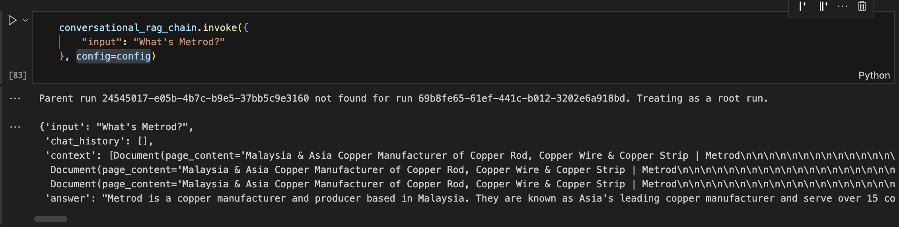
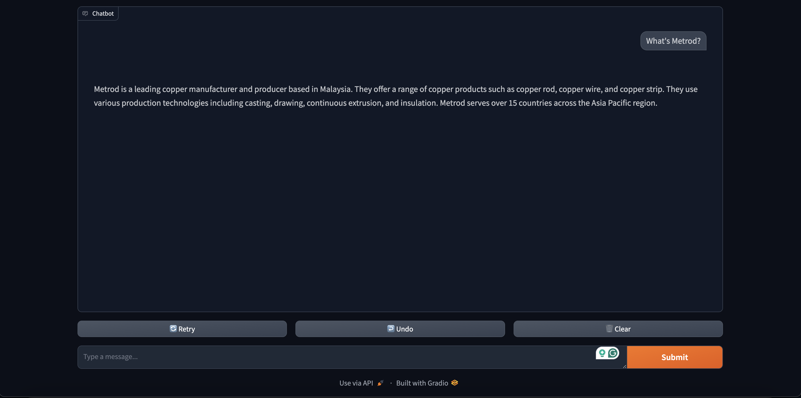

- [Introduction](#introduction)
- [RAG Architechture](#rag-architechture)
  - [What are the benefits of RAG?](#what-are-the-benefits-of-rag)
  - [Implementing RAG-Based Chatbot for Websites](#implementing-rag-based-chatbot-for-websites)
    - [Prepare and Storage of Knowledge](#prepare-and-storage-of-knowledge)
      - [Web Scraping](#web-scraping)
      - [Chunking](#chunking)
      - [Embedding and Storage](#embedding-and-storage)
    - [Retrieval of Information](#retrieval-of-information)
      - [Handling Questions, Memory, and Retrieval](#handling-questions-memory-and-retrieval)
      - [Creating a Q\&A Chain](#creating-a-qa-chain)
    - [Chatbot Interface with Gradio](#chatbot-interface-with-gradio)
- [Conclusion](#conclusion)

# Introduction

In today's digital landscape, chatbots have become essential for enhancing website user experience by providing immediate, 24/7 support. They guide users through complex processes and answer queries in real time, significantly reducing response times and improving customer satisfaction. By managing multiple conversations simultaneously, chatbots reduce the need for extensive human resources and gather valuable data on user behavior, preferences, and common issues, enabling continuous improvement. Additionally, chatbots offer personalized responses using user data, creating unique interactions that deepen the user's connection with your website and suggest products and services based on customer needs.

Incorporating advanced technologies can further amplify these benefits. One such innovation is Retrieval Augmented Generation (RAG),  which enhances chatbot capabilities by combining information retrieval and text generation.

# RAG Architechture

In RAG, a chatbot retrieves relevant information from a database or document repository and then generates a coherent response using a Large Language Model (LLM) such as ChatGPT, ensuring both accuracy and contextual relevance. Key technologies facilitating RAG include LangChain, which provides tools for building conversational AI, and ChromaDB, a powerful vector database for efficient data retrieval and management. Together, these technologies enable the creation of highly responsive and intelligent chatbots, significantly boosting website user experience.


## What are the benefits of RAG?

There are several important advantages to the RAG approach:

- RAG ensures that an LLM's response isn't based just on old, stagnant traning data. Instead, the model gets its answers from current external data sources.
  
- RAG aims to reduce the possibility of generating false or misleading information (sometimes referred to as hallucinations) by grounding the LLM model's output on pertinent, outside knowledge. Citations to the original sources can be included in the outputs, enabling human verification.
  
- By utilizing RAG, the LLM can deliver contextually appropriate answers that are customized to an organization's propriate or domain-specific data.

## Implementing RAG-Based Chatbot for Websites

The architecture for a chat with websites involves extracting, splitting, and chunking data from web sources, converting this data into embeddings using an OpenAI LLM, and storing these embeddings in a vector database for efficient retrieval. When a user inputs a question, it is converted into an embedding, and a vector search is performed to find the most relevant data chunks. The system combines these chunks with the chat history to generate a contextually accurate response using the OpenAI LLM, continuously updating the chat history for ongoing conversations.


### Prepare and Storage of Knowledge

#### Web Scraping

The first step invlolves scraping your website to extract the content. This is achieved using Beuftifulsoup, a powerful Python library for parsing HTML and XML documents. The scraped content forms the basis for out chatbot's knowledge base. Subsequently, filter these documents to keep only text or HTML files.

```python
def load_documents(url: str) -> List[dict]:
      """Loads documents from the specified URL."""

      loader = RecursiveUrlLoader(
          url=url, max_depth=2, extractor=lambda x: Soup(x, "html.parser").text, headers=headers
      )
      documents = loader.load()
      
      filtered_documents = [doc for doc in documents if doc.metadata['content_type'].lower() == "text/html; charset=utf-8"]
    
      return filtered_documents
```

#### Chunking

When spliting the text corpus of the knowledge base into chunks sourced from various materials like website's data. The chunk size and the method, whether sliding or tumbling window, impacts retrieval efficiency. Finding the right balance is important to ensure enough context is preserved for accurate retrieval while avoiding overly broad chunks that could dilute relevance.

```python
def split_documents(self, documents: List[dict]) -> List[dict]:
  """Splits documents into smaller chunks."""
    text_splitter = RecursiveCharacterTextSplitter()      
    return text_splitter.split_documents(documents)
```

#### Embedding and Storage

Utilize an embedding model from **OpenAI** to convert each chunk into a vector representation. The choice of embedding model that effectively captures the nuances of the data is crucial as it affects the retrieval quality.

Store all vector embedding in a Vector Database alongside the text representing each embedding and a pointer to it for later retrieval. Ensure the vector database can handdle high query volumes with low latency, especially for dynamic, user-facing applications.

Bellow are all the components to scrape and store web data into ChromaDB for use in a chatbot system.

```python
# data_ingestion.py
from bs4 import BeautifulSoup as Soup
from langchain_community.document_loaders.recursive_url_loader import RecursiveUrlLoader
import re
from typing import List
from langchain_openai import AzureOpenAIEmbeddings
from langchain_community.vectorstores import Chroma
from langchain_text_splitters import RecursiveCharacterTextSplitter
import os 

DATAPATH="./vector_store"


class Website2DB(object):
    def __init__(self, embedding_model: AzureOpenAIEmbeddings):
        self.embedding_model = embedding_model
    
    def extract_domain(self, url: str) -> str:
        """Extracts the domain from a URL."""
        pattern = r"(https?://)?(www\d?\.)?(?P<domain>[\w\.-]+\.\w+)(/\S*)?"
        match = re.match(pattern, url)
        return match.group("domain") if match else None

    def prepare_headers(self) -> dict:
        """Prepares HTTP headers for web scraping."""
        return {
            "User-Agent": "Mozilla/5.0 (Windows NT 10.0; Win64; x64) AppleWebKit/537.36 (KHTML, like Gecko) Chrome/91.0.4472.124 Safari/537.36",
            "Accept-Language": "en-US,en;q=0.9",
            "Accept-Encoding": "gzip, deflate, br",
            "Connection": "keep-alive",
            "Referer": "http://www.google.com/"
        }
        
    def load_documents(self, url: str) -> List[dict]:
        """Loads documents from the specified URL."""
        headers = self.prepare_headers()
        loader = RecursiveUrlLoader(
            url=url, max_depth=2, extractor=lambda x: Soup(x, "html.parser").text, headers=headers
        )
        documents = loader.load()
        
        filtered_documents = [doc for doc in documents if doc.metadata['content_type'].lower() == "text/html; charset=utf-8"]
        
        return filtered_documents

    def split_documents(self, documents: List[dict]) -> List[dict]:
        """Splits documents into smaller chunks."""
        text_splitter = RecursiveCharacterTextSplitter()
        
        return text_splitter.split_documents(documents)

    def store_data(self, url: str) -> Chroma:
        """Scrapes data from the given URL and stores it in the vector database."""
        domain_name = self.extract_domain(url)
        if domain_name:
            domain_name = domain_name.replace(".", "_")
            documents = self.load_documents(url)
            split_docs = self.split_documents(documents)

            persist_directory = os.path.join(DATAPATH, domain_name)
            db = Chroma.from_documents(split_docs, 
                                   self.embedding_model, 
                                   persist_directory=persist_directory)
            return db
        else:
            raise ValueError("Invalid URL provided")
        
    def __call__(self, url):
        return self.store_data(url=url)       
```

### Retrieval of Information

Now, we can create a chatbot to interact with our vector store. Specifically, we’ll build a question-and-answer (Q&A) chatbot that allows us to ask questions about the scraped data and returns its sources, addressing concerns about chatbot accuracy and hallucinations.

To build our chatbot, we’ll use LangChain, a framework for developing applications on top of LLMs, which simplifies much of the prompt engineering work. We’ll use AzureOpenAI’s GPT-3.5-turbo chat model as our LLM.

#### Handling Questions, Memory, and Retrieval

As we interact with our model to ask questions about our scraped website, we need to convert these questions into embeddings to query our vector store effectively. Since questions might depend on previous interactions, we condense the chat history into a single, standalone question that can be embedded and used to query the vector store. We then retrieve the most relevant documents from the database. This process is handled by a function called **history_aware_retrieval**, which prompts our language model with instructions to generate and retrieve relevant document embeddings.

```python
def history_aware_retrieval():
    contextualize_q_system_prompt = """Given a chat history and the latest user question \
which might reference context in the chat history, formulate a standalone question \
which can be understood without the chat history. Do NOT answer the question, \
just reformulate it if needed and otherwise return it as is."""

    contextualize_q_prompt = ChatPromptTemplate.from_messages(
        [
            ("system", contextualize_q_system_prompt),
            MessagesPlaceholder("chat_history"),
            ("human", "{input}"),
        ]
    )

    history_aware_retriever = create_history_aware_retriever(
        self.llm, self.db, contextualize_q_prompt
    )

    return history_aware_retriever
```

#### Creating a Q&A Chain

The basic of asking questions and getting answered is handled with LangChain's QA chains. These are a set of classes and helper functions that aid us in building a Q&A system  on top of a data retriever object. The data retriver will just be our embedded vector store we created earlier.

We'll start by creating a Q&A chain that will retrieve its sources.

```python
def qa_chain():
    SYS_PROMPT = """You are an assistant for question-answering tasks on the website. \
Use the following pieces of retrieved context to answer the question. \
Depend solely on the following pieces of retrieved context to answer the question without explanation.

{context}
"""
    qa_prompt = ChatPromptTemplate.from_messages(
        [
            ("system", SYS_PROMPT),
            MessagesPlaceholder(variable_name="chat_history"),
            ("human", "{input}"),
        ]
    )
    question_answer_chain = create_stuff_documents_chain(
        self.llm, qa_prompt)

    return question_answer_chain

```
The **context** in the **qa_chain** function plays a crucial role as it provides the specific information that relevant documents retrived from the vector store for generating accurate and relevant answers to user questions. 

Finally, we wrap up the Q&A retrieval by finally loading our vector store with Chroma, set it up as a retriever.

```python
from typing import Any
from langchain.chains.retrieval import create_retrieval_chain
from langchain.chains.combine_documents import create_stuff_documents_chain
from langchain_core.prompts import ChatPromptTemplate, MessagesPlaceholder
from langchain_core.runnables.config import RunnableConfig
from langchain_core.runnables import Runnable
from langchain_community.vectorstores import Chroma
from langchain_openai import AzureChatOpenAI
from langchain.chains.history_aware_retriever import create_history_aware_retriever

class WebsiteAgentRunnable(Runnable):
    def __init__(self, llm: AzureChatOpenAI, db: Chroma) -> None:
        super(WebsiteAgentRunnable, self).__init__()
        self.llm = llm
        self.db = db

    def qa_chain(self):
        SYS_PROMPT = """You are an assistant for question-answering tasks on the website. \
Use the following pieces of retrieved context to answer the question. \
Depend solely on the following pieces of retrieved context to answer the question without explanation.

{context}
"""
        qa_prompt = ChatPromptTemplate.from_messages(
            [
                ("system", SYS_PROMPT),
                MessagesPlaceholder(variable_name="chat_history"),
                ("human", "{input}"),
            ]
        )
        question_answer_chain = create_stuff_documents_chain(
            self.llm, qa_prompt)

        return question_answer_chain

    def history_aware_retrieval(self):
        contextualize_q_system_prompt = """Given a chat history and the latest user question \
which might reference context in the chat history, formulate a standalone question \
which can be understood without the chat history. Do NOT answer the question, \
just reformulate it if needed and otherwise return it as is."""

        contextualize_q_prompt = ChatPromptTemplate.from_messages(
            [
                ("system", contextualize_q_system_prompt),
                MessagesPlaceholder("chat_history"),
                ("human", "{input}"),
            ]
        )

        history_aware_retriever = create_history_aware_retriever(
            self.llm, self.db, contextualize_q_prompt
        )

        return history_aware_retriever

    def rag_chain(self):
        # create question-answer chain
        question_answer_chain = self.qa_chain()
        # retrieve based on history-aware retrieval
        history_aware_retriever = self.history_aware_retrieval()
        # create retrieval chain
        retrieval_chain = create_retrieval_chain(history_aware_retriever, question_answer_chain)

        return retrieval_chain

    def invoke(self, input: Any, config: RunnableConfig) -> Any:
        return self.rag_chain().invoke(input, config)

```

And that's it. The class **WebsiteAgentRunnable** is the last chain is designed to handle question-answering tasks using a retrival-augmented generation (RAG) approach. In our example, we scraped the **Metrod** website, so let's ask about the website information-related question.



Of course, this is not the best way to interface with our bot. For that, we can use Gradio.


### Chatbot Interface with Gradio

Gradio is a very powerful framework for building AI demos. It can quickly create beautiful web interfaces that can interact with an underlying AI bot, and serve the interfaces locally.

To get started, we first install it 

```bash 
pip install gradio
```

and in our **main.py** file, all we need to do is add the following:

```python
import gradio
URL = "https://metrod.com"

def chat(message, history):
    embedding_model = AzureOpenAIEmbeddings(
        azure_endpoint=azure_endpoint,
        openai_api_version=openai_api_version,
        openai_api_key=openai_api_key,
        deployment=embedding_deployment
    )
    llm = AzureChatOpenAI(
        azure_endpoint=azure_endpoint,
        openai_api_version=openai_api_version,
        azure_deployment=azure_deployment,
        openai_api_key=openai_api_key,
        streaming=True,
        temperature=0.7,
    )
    store_db = Website2DB(embedding_model=embedding_model)

    db = store_db(url=URL).as_retriever(search_kwargs={"k": 3})

    website_chain = WebsiteAgentRunnable(llm=llm, db=db)
    memory = ConversationBufferWindowMemory(k=3, return_messages=True)
    config = RunnableConfig({'configurable': {'session_id': None}})

    conversational_rag_chain = RunnableWithMessageHistory(
        website_chain,
        lambda session_id: memory.chat_memory,
        input_messages_key="input",
        history_messages_key="chat_history",
        output_messages_key="answer"
    )
    response = conversational_rag_chain.invoke({"input": message}, config=config)
    answer = response["answer"]
    return answer

gradio.ChatInterface(predict).launch()

```

1. Creates a **chat** function that takes in a message and history arguments. We don’t need the history, since we track it already with **RunnableWithMessageHistory**, but **Gradio’s ChatInterface** will require it.
2. The message variable is passed to the **conversational_rag_chain** model as a question.
The response from the model is a string that takes a json schema. We load the answer and then generate a nice output for the user.
3. We then setup a **Gradio ChatInterface** and launch it.


We can then run 

```python
python main.py
```

to launch out Gradio server. This is what it looks like.



Our previous question now looks really good, and we can now chat with our bot in a natural interface.


# Conclusion

Our chatbot performs quite well when asked direct questions and can answer multiple questions in sequence while maintaining a memory of past interactions.

However, our chatbot is less effective when dealing with out-of-scope topics. To address this, we can enhance its performance by implementing input and output guardrails. These guardrails will help ensure that the chatbot avoids responding to sensitive questions, such as those requesting personal information or sensitive website data.

If you have any questions, please feel free to reach out to me at **vietawake@gmail.com** or leave a comment on this blog. I would also love to hear if you found this work inspiring!