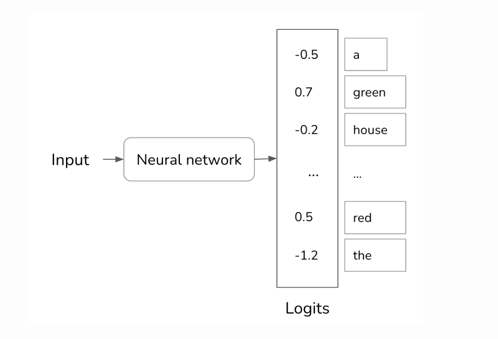

- [LLM Settings](#llm-settings)
  - [Temperature](#temperature)
  - [Top-k](#top-k)
  - [Top-p](#top-p)
  - [Max Length](#max-length)
  - [Stop Sequences](#stop-sequences)
  - [Frequency Penalty](#frequency-penalty)
  - [Presence Penalty](#presence-penalty)
- [Test Time Sampling](#test-time-sampling)
- [Ref](#ref)


# LLM Settings

When designing prompts, We have few configs like Temperature, Top P, Max Length, Stop Sequences, Frequency Penalty, Presence Penalty. Below are the common setting and the explanation of them.

## Temperature

Temperature is the technique used to redistribute the probabilities of the possible values. Intuitively, it reduces the probabilities of common tokens, and as the result, increases the probabilities of rarer tokens. Increase the temperature could lead to more randomness, which encourages more diverse or creative outputs.

Instead of always picking the next most likely token, we can  sample the next token according to the probability distribution over all possible values. Given the context of **My favorite color is …,** if red has 30% change of being the next token and green has a 50% chance, red will be picked 30% of the time and “green” 50% most of the time. The common words for colors like green, red, purple, etc. have highest probabilities. Because “the” has  a low probability, the model has a  low chance of generating the creative sentence such as “My favorite color is the color of  a still lake on a spring morning.”

To understand how temperature works, let’s take a step back to see how a model computes the probabilities. Given an input, a neural network processes this input and outputs a logit vector. Each logit corresponds to one possible. In the case of a language model, each logit corresponds to one token in the model’s vocab. The logit vector size is the size of the vocab.



While larger logits correspond to higher probabilities, the logits don’t represent the probabilities. Logits don’t sum up to one. Logits can even be negative. while probabilities have to be no-negative. To convert logits to probabilities, a softmax layer is often used. Let’s say the model has a vocab of N and the logit $[x_1, x_2,...,x_n]$. The probability for the $i^{th}$ token, $p_i$, is computed as follows:


$$
P_i = softmax(x_i) = \frac{e^{x_i}}{\sum_{j}e^{x_j}}
$$

Temperature is a constant used to adjust the logits before  the softmax transformation. Logits are divided by temperature. For given a temperature T, the adjusted logit for the $i^{th}$ token is $\frac{x_i}{T}$. Softmax is then applied on this adjusted logit instead of on $x_i$.

```python
import numpy as np 

def compute_softmax(logits: np.array, T: int):
    """compute softmax for logits vector

    Args:
        logits (np.array): logits vector
        T (int): temperature value
    """
    sum_exp = np.sum(np.exp(logit/T) for logit in logits)
    
    softmax = [ np.exp(logit/T) /  sum_exp for logit in logits]
    
    return softmax
```

for example, let’s the binary classification model and the logit computed the last layer are $[1, 3]$.

- Without using temperature, that’s mean temperature = 1, the softmax probabilities are $[0.12, 0.88]$. The model picks B 88% of the time.
- With temperature 0.5, the probabilities are $[0.02, 0.98]$. The model picks B 98% of the time.
- With temperature 2, the probabilities are $[0.27, 0.73]$. The model picks B 73% of the time.
- With temperature 0.1, the probabilities are $[0.003, 0.997]$. The model picks B 99.7% of the time.
- With temperature 1000, the probabilities are $[0.499, 0.501]$. The model picks A and B almost equally.

As we can see from the examples above, adjusting the temperature can greatly impact the distribution of probabilities and the model's output. Lower temperatures (e.g., 0.1) make the model more confident and conservative, favoring high probability tokens. On the other hand, higher temperatures (e.g., 1000) introduce more randomness and diversity in the generated text.

It is important to experiment with different temperature values to achieve the desired level of creativity and control in the generated prompts.

When we do a task with a high probability and need model stable, you should choose a lower $T$. For the task that require more creativity, it should be set higher.

For example:

**Higher temperature**: product description, product review, create content.

**Lower temperature**: Down stream task NLP like classification task.

The common practice to set the temperature to 0 for the model’s output to be more consistent. Truly, temperature can never be 0 - because logits can’t be divided by 0. In practice, when we set the temperature to 0, the model just pick the token with the value with largest logit, without doing the logit adjustment and softmax calculation.

## Top-k

Top-k is a sampling strategy to reduce the computation workload without sactificing too much of the model’s response diversity. Softmax requires two passes over positive values: one to perform the exponential $\sum_{j}{e^{x_j}}$ and one perform $\frac{e^{x_j}}{\sum_{j}{e^{x_j}}}$ for each value. For LLM the vocab size is too large, this process is computationally expensive.

To avoid this problem, after the model has computed the logits, we picked the top k logits and perform the softmax over these top k logits only. Depending on how diversity you want to your application to be,k can be anywhere from 50 to 500. Much smaller than a model’s vocab size. The model then samples from these top values. A smaller k value makes the text more predictable but less interesting, as the model is limited to a smaller set of likely words.

## Top-p

In the Top-k sampling, the number of values considered is fixed to k. However, this number should change depending on the situation.

In top-p sampling, the model sums the probabilities of the most likely next values in descending order and stops when the sum reaches p.

For example: Do you like me?


If top-p = 0.91 ⇒  “yes”, “maybe”  will be considered to choose for this question. If top-p = 0.99, then “yes”, “maybe”, ”no” are considered.

So, low top_p value select the most confident responses. This mean that a high top_p value will enable the model to look at more possible words.

## Max Length

The max length setting determines the maximum number of tokens allowed in the generated prompt. This is useful for controlling the length of the output and avoiding excessively long or truncated prompts. By setting a specific max length, we can ensure that the generated prompts are within a desired range and meet the requirements of the application or task at hand.

For example, if we set the max length to 50, the generated prompt will not exceed 50 tokens in length. This can help maintain readability and coherence in the output, especially for tasks such as product descriptions or content generation.

## Stop Sequences

An autoregressive model generates sequences of tokens by generating one token after another. One the easy way method is to ask the models to stop after fixed number of tokens like max length in the above. Another method is to use the stop tokens.

For example, you can ask models to stop generating when it encounters “\<EOS>”. Stopping conditions are helpful to keep the latency and cost down.

## Frequency Penalty

It applies a penalty on the next token that mean how many times that token already appeared in the response and prompt. The higher frequency penalty, the less likely a word will appear again. This setting reduce the repetition of words in the model’s response by giving tokens that appear with more higher penalty.

## Presence Penalty

It also applies a penalty on repeated tokens but, unlike the frequency penalty, the penalty is the same for all repeated tokens. This setting prevents the model from repeating phrases too often in its response.

# Test Time Sampling

One simple way to improve a model’s performance is to generate multiple outputs and select the best one. This approach is called test time sampling.

One selection method is to pick the output with the highest probability. A language model’s output is a sequence of token, each token has a probability computed by the model. The probability of an output is the product of the probabilities of all tokens in output.

Consider the sequence of tokens $["I", "love", "you"]$ and:

- the probability for $I$  is $0.2$
- the probability for $love$ given $I$ is $0.1$
- the probability for $you$ given $I$ and $love$ is 0.3

The sequence’s probability is then: $0.2 * 0.1 * 0.3 = 0.006$

Mathematically, this can be denoted as follows:

$$
p(Iloveyou) = p(I) * p(love|I) * p(you| I, love)
$$

Remember that it’s easier to work with probabilities on a log scale. The logarithm of a product is equal to a sum of logarithms, so the logprob of a sequence of all tokens in the sequence.

$$
logprob(Iloveyou) = logprob(I) + logprob(love|I) + logprob(you| I, love)
$$


To avoid the biasing towards short sequences, we use the average logprob by dividing the sum by its sequence length. After sampling the multiple outputs, we pick the one with the highest average logprob.  You can set the parameter best_of to specific value, say 10, to ask OpenAI model return the output with the highest average logprob out of 10 different outputs.

# Ref

- [https://huyenchip.com/2024/01/16/sampling.html](https://huyenchip.com/2024/01/16/sampling.html)
- [https://www.promptingguide.ai/introduction/settings](https://www.promptingguide.ai/introduction/settings)
