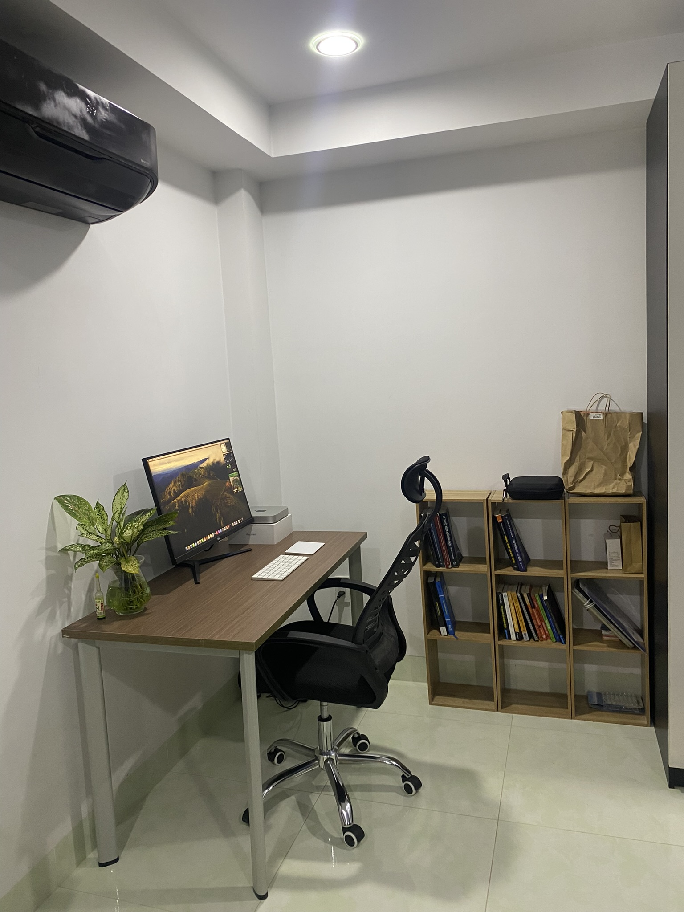
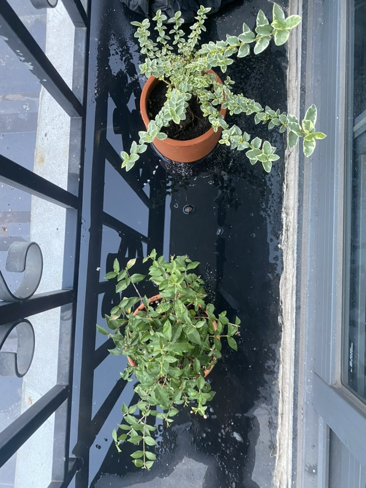
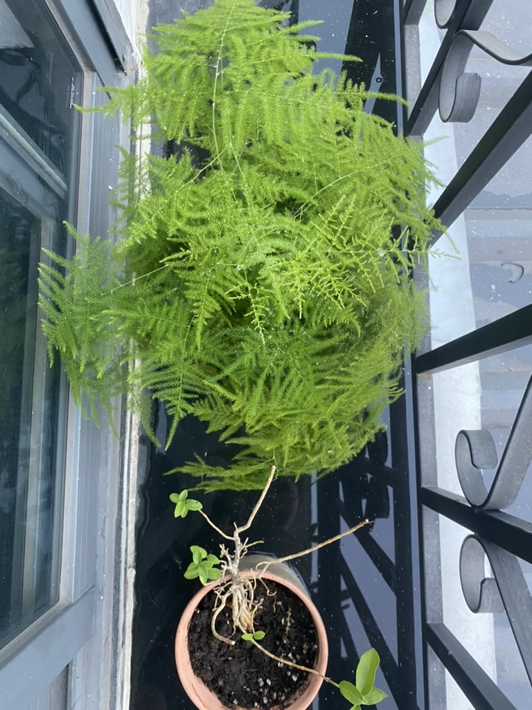
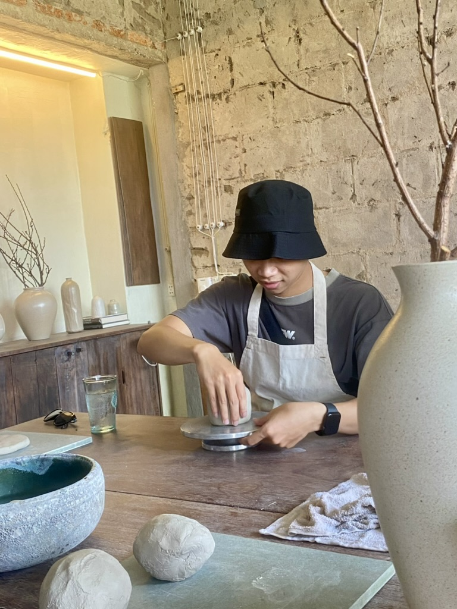
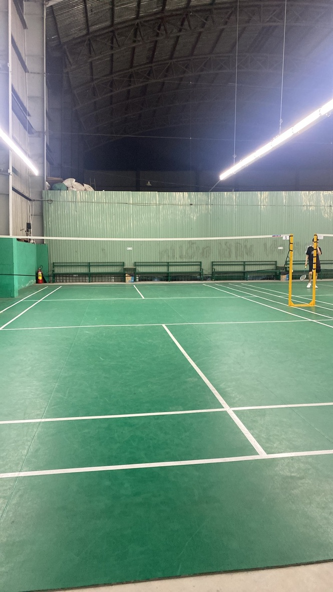

- [Chuyển nhà](#chuyển-nhà)
  - [Setup chỗ làm việc](#setup-chỗ-làm-việc)
  - [Góc chill](#góc-chill)
  - [Trồng cây](#trồng-cây)
  - [Làm gốm](#làm-gốm)
  - [Thể thao](#thể-thao)

# Chuyển nhà

Thế là hôm nay đã được một tuần tôi chuyển nhà rồi. Tuần rồi vừa sắp xếp đồ đạc, chuyển nhà, dọn dẹp nhà cửa ở chỗ mới, hoàn thành một số thủ tục các thứ để bắt đầu một cuộc sống ở nơi mới. 

Đây là một trong những việc mà tôi muốn làm từ khi ăn tết xong. Chuyến đến một nơi có điều kiện tốt hơn, không gian tốt hơn, mát mẻ hơn, làm cho tôi cảm thấy chất lượng cuộc sống được cải thiện rõ rệt. Không còn suy nghĩ quá nhiều về những chuyện trước đó nữa.

## Setup chỗ làm việc

ở đây có một không gian đủ rộng để tôi có thể setup được một nơi làm việc thoải mái nhất có thể, tôi decor lại chỗ làm việc của mình thật gọn gàng và để thêm 1 bình cây xanh trên bàn để những lúc nhìn màn hình lâu quá thì có thể nghía qua ngắm cây :))).  bên cạnh đó là một cái kệ đọc sách của tôi. Nhìn quá là trống. Mục tiêu năm nay là đọc nhiều sách hơn đủ thể loại hơn trong đó có những thể loại mà tôi đang quan tâm là về tâm lí học, về văn học, về lịch sử. 

Về tâm lí học, tôi thấy có cuốn **Tâm Lí Học Nhận Thức**, **Lý Thuyết Trò Chơi**. Lí do tôi muốn đọc thể loại này là vì tôi thấy mình chưa hiểu về tâm lí bản thân lắm. Đọc thể loại này tôi có thể mở mang thêm về kiến thức tâm lí, về EQ để tốt hơn cho sau này. 

Về văn học, tôi sẽ đọc cuốn **Không Gia Đình**, một cuốn sách khá là nổi tiếng nhưng tôi lại chưa đọc :))). Đọc lại cuốn **Nhà Giả Kim** để có thể đắm chìm vào cậu bé chăn cừu đi tìm lẽ sống cũng như hành trình của cậu, làm tôi thấy bản thân mình từ những ngày đặt bước chân đầu tiên và tôi vẫn sẽ giữ tiếp ngọn lửa ấy để đi tiếp trên chặng đường về sau này. 

Về lịch sử, tôi muốn đọc cuốn **Tam Quốc Chí**, thật sự thì tôi rất thích về lịch sử Trung Quốc, mặc dù chỉ coi phim từ thời **Tần Thuỷ Hoàng** đến **Hán Sở Tranh Hùng** và mãi về sau là **Tam Quốc**. Nó cho tôi thấy được chiến lược, các nhân vật tầm cỡ của lịch sử, cách họ tư duy để giải quyết một vấn đề. 

## Góc chill 

Còn đây là góc để chill, có một cái ban công xinh xắn, mỗi lần mở cửa ban công ra vào buổi tối ngắm cây cảnh, landmark, thật là làm cho người ta cảm thấy thoải mái. Sau này tôi sẽ mua thêm vài chai bia ngon về, thêm ít mồi nhậu, vừa ngắm cảnh sg về đêm vừa uống bia. Nghĩ thôi là đủ khiến bản thân thấy dui rồi nơi mà không còn những thứ mệt mỏi chỉ có enjoy cái moment này. 😘

## Trồng cây

|                        |                        |
|---------------------- | ---------------------- |
|  |  |

Còn đây là những cái cây tôi trồng, giờ chúng nó đã có nhà mới rồi nhen. Cũng may từ hồi trồng tới giờ mới chỉ chết có một cây. :))) Còn lại vẫn sống tốt. Trồng cây, tưới nước nhìn nó phát triển lớn lên giúp tôi thấy được rằng mọi thứ trên đời này muốn phát triển cần phải có sự chăm sóc và đầu tư. Chợt nhật ra là quá lâu rồi tôi chưa chăm sóc cho bản thân mình gì cả…haizz. Thật là có lỗi với bản thân mà. 

## Làm gốm

Còn đây là một buổi trải nghiệm đi làm gốm thú vị với những người bạn già từ thời cấp 3 của tôi. Tự tay nặn tự tay làm ra một sản phẩm bằng đôi tay mình thật là điều gì đó thấy tự hào mặc dù có một bạn nữ ở buổi workshop đó hướng dẫn rất nhiệt tình. Không khí hôm đó rất vui và sau này tôi sẽ quay lại làm tiếp. 😙

## Thể thao 

Còn đây là một trong những mục tiêu năm nay của tôi là chơi một môn thể thao và tôi chọn cầu lông. Thế mà đã ngót nghét đánh được khá là nhiều buổi rồi. Riêng tuần này tôi đánh tới 3 hôm. Một trận đánh vs mấy anh chị trong công ty, một trận đánh với bạn bé Giang (đứa em toán tin dưới tôi một khoá thời còn học cấp 3) và một trận đánh vs mấy đứa bạn tôi. Tới h thì người mệt lã lời tay chân đau nhứt. Tuy nhiên, sức khoẻ là một thứ tôi muốn đầu tư, có sức khoẻ mới làm được nhiều việc.

Bài viết tới đây cũng đã dài. Tôi xin kết thúc ở đây.!!!! Thanks for all.

